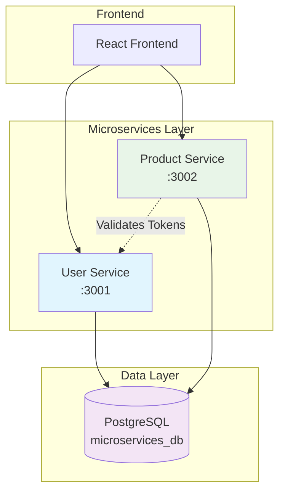
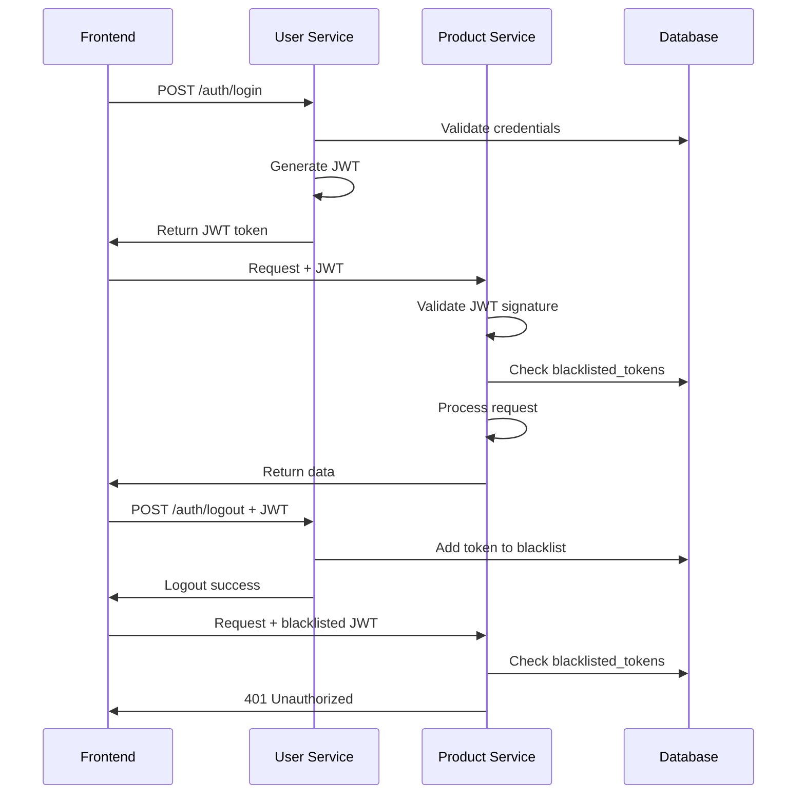
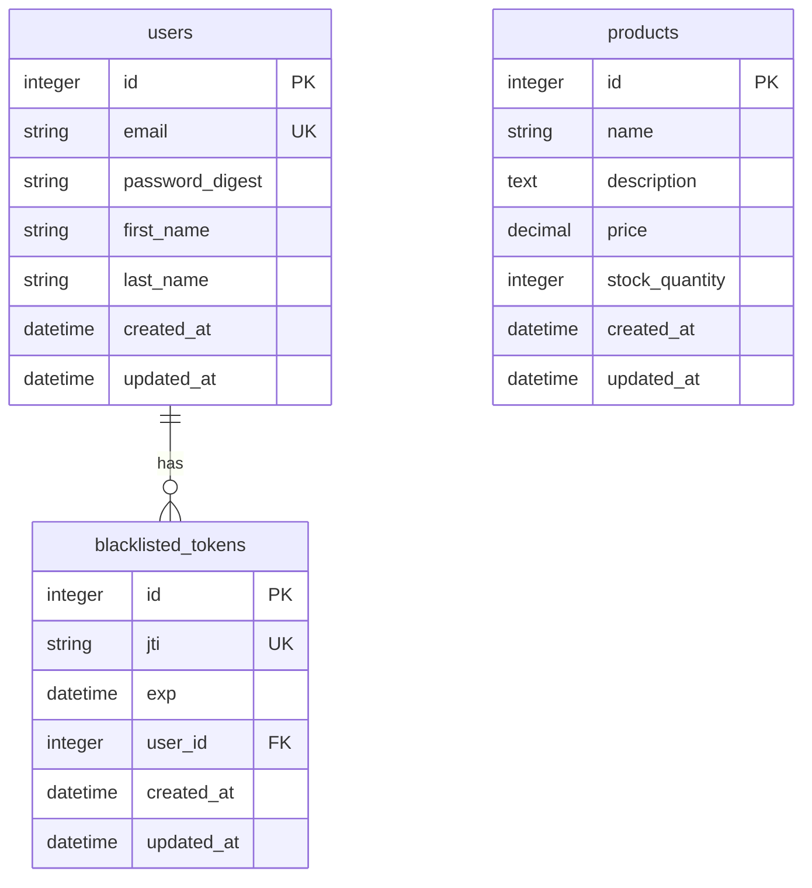

# Microservices Architecture - Product Services

## 📋 Overview
The Product Service is a Rails API microservice that handles product management with JWT token validation. It provides full CRUD operations for products and validates authentication tokens from the User Service.

## 🏗️ System Architecture



## 🔄 Authentication Flow



---

## 🏗️ Architecture

```mermaid
graph TB
    subgraph "Product Service"
        A[Products Controller] --> B[Product Model]
        C[Token Verifier] --> D[BlacklistedToken Check]
    end

    subgraph "External Services"
        E[User Service] --> F[JWT Token]
        G[Frontend/Client] --> A
    end

    subgraph "Database"
        H[PostgreSQL]
        B --> H
        D --> H
    end

    F --> C

    style A fill:#e8f5e8
    style C fill:#fff3e0
    style E fill:#e1f5fe
`
## 🚀 Features

- ✅ **Product Management** - Full CRUD operations for products
- ✅ **JWT Validation** - Verifies tokens from User Service
- ✅ **Secure Access** - All endpoints require valid authentication
- ✅ **Shared Database** - Uses same database as User Service
- ✅ **Health Monitoring** - Service status endpoint

## 📁 Project Structure

```
product-service/
├── app/
│   ├── controllers/
│   │   ├── products_controller.rb
│   │   └── health_controller.rb
│   ├── models/
│   │   ├── product.rb
│   │   └── blacklisted_token.rb
│   └── services/
│       └── token_verifier.rb
├── config/
│   ├── database.yml
│   └── routes.rb
└── db/
    └── schema.rb
```

## 🔧 API Endpoints

| Method | Endpoint | Description | Authentication |
|--------|----------|-------------|----------------|
| GET | `/products` | List all products | Yes |
| GET | `/products/:id` | Get specific product | Yes |
| POST | `/products` | Create new product | Yes |
| PUT | `/products/:id` | Update product | Yes |
| DELETE | `/products/:id` | Delete product | Yes |
| GET | `/health` | Service health check | No |

## 🛠️ Installation & Setup

### Prerequisites
- Ruby 3.0+
- Rails 7.0+
- PostgreSQL
- User Service (for authentication)

### Installation Steps
```bash
# Clone and setup
git clone <repository>
cd product-service

# Install dependencies
bundle install

# Setup database (uses same DB as User Service)
rails db:create
rails db:migrate
rails db:seed

# Set JWT secret (MUST match User Service)
echo "JWT_SECRET_KEY=your_shared_jwt_secret" > .env

# Start server
rails server -p 3002
```

## Setting Up Credentials
```bash
# Edit credentials (requires master key)
EDITOR="code --wait" rails credentials:edit
```

### Add to credentials.yml.enc:
```yaml
database:
  database: microservices_db
  username: your_username
  password: your_password

jwt_secret: your_secure_jwt_secret_key_here
```

## 🧪 Testing

```bash
# First, get token from User Service
TOKEN=$(curl -s -X POST http://localhost:3001/auth/login \
  -H "Content-Type: application/json" \
  -d '{"email": "user@example.com", "password": "password123"}' | \
  grep -o '"token":"[^"]*' | cut -d'"' -f4)

# Test product listing
curl -X GET http://localhost:3002/products \
  -H "Authorization: Bearer $TOKEN"

# Test product creation
curl -X POST http://localhost:3002/products \
  -H "Authorization: Bearer $TOKEN" \
  -H "Content-Type: application/json" \
  -d '{
    "product": {
      "name": "New Product",
      "description": "Product description",
      "price": 99.99,
      "stock_quantity": 10
    }
  }'
```

## 📊 Database Schema

```sql
CREATE TABLE products (
  id SERIAL PRIMARY KEY,
  name VARCHAR(255) NOT NULL,
  description TEXT,
  price DECIMAL(10,2) NOT NULL,
  stock_quantity INTEGER DEFAULT 0,
  created_at TIMESTAMP DEFAULT CURRENT_TIMESTAMP,
  updated_at TIMESTAMP DEFAULT CURRENT_TIMESTAMP
);
```

---

# 📊 Complete Database Schema



---

# 🚀 Quick Start Guide

## 1. Start Both Services

```bash
# Terminal 1 - User Service
cd user-service
rails server -p 3001

# Terminal 2 - Product Service
cd product-service
rails server -p 3002
```

## 2. Test Authentication Flow

```bash
# 1. Login to get token
curl -X POST http://localhost:3001/auth/login \
  -H "Content-Type: application/json" \
  -d '{"email": "test@example.com", "password": "password123"}'

# 2. Use token in Product Service
curl -X GET http://localhost:3002/products \
  -H "Authorization: Bearer YOUR_TOKEN"

# 3. Logout (blacklists token)
curl -X POST http://localhost:3001/auth/logout \
  -H "Authorization: Bearer YOUR_TOKEN" \
  -H "Content-Type: application/json"

# 4. Verify token is rejected
curl -X GET http://localhost:3002/products \
  -H "Authorization: Bearer YOUR_TOKEN"
```

## 3. Health Checks

```bash
curl http://localhost:3001/health
curl http://localhost:3002/health
```

---

# 🔧 Development Commands

```bash
# Run migrations
rails db:migrate

# Seed sample data
rails db:seed

# Check logs
tail -f log/development.log

# Run tests (if configured)
rails test
```

---

# 📝 Notes

- **JWT Secret**: Must be identical in both services
- **Database**: Both services share the same PostgreSQL database
- **CORS**: Configured to allow frontend connections
- **Token Expiry**: 1 hour automatic expiration
- **Logout**: Immediately blacklists tokens across all services

---

# 🎯 Next Steps

Potential services to add to the architecture:
1. **Order Service** - Handle orders and order items
2. **Inventory Service** - Manage product stock levels
3. **Payment Service** - Process payments
4. **Notification Service** - Send emails/notifications
5. **API Gateway** - Single entry point for all services

---

## 📞 Support

For issues and questions:
1. Check service health endpoints
2. Verify JWT secret synchronization
3. Check database connectivity
4. Review application logs

---

**🎉 Microservices Architecture Successfully Implemented!**
